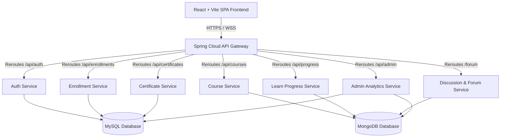

<div align="center">

# 🌌 LearnSphere

### *A Premium, Microservice-Driven Full-Stack Learning Management System*

[](https://react.dev/)
[](https://spring.io/projects/spring-boot)
[](https://openjdk.org/)
[](https://www.mysql.com/)

---

**LearnSphere** is a state-of-the-art, high-performance learning ecosystem built with a modular microservices architecture. It combines a dynamic, motion-rich React single-page application with a scalable, highly secure Spring Boot and Java 21 backend mesh, providing seamless e-learning journeys for learners, comprehensive control tools for instructors, and governance portals for administrators.

[✨ Explore Features](#-key-features) • [🏗️ Architecture](#-system-architecture) • [🚀 Tech Stack](#-technology-stack) • [🔧 Setup Guide](#-installation--local-setup) • [🌐 Deployment](#-production-deployment-strategy)

</div>

---

## 🌟 Key Features

LearnSphere is designed with specialized interfaces for all three target roles in the learning lifecycle:

### 🎓 1. Learner Experience
* **Interactive Classrooms**: Fluid lesson progression, video contents, and interactive reading materials.
* **Smart Assessments**: Real-time quiz execution, timers, instant scoring, and performance result metrics.
* **Verifiable Credentials**: Direct PDF/Image certificate generation upon completion, with dynamic cryptographic verification codes searchable by the public.
* **Secure Checkout**: Complete payment gateway integrations for premium courses with custom visual receipt flows.

### 👨‍🏫 2. Instructor Toolkit
* **Drag-and-Drop Course Builder**: Effortlessly write descriptions, add categories, configure pricing, upload media assets, and construct learning paths.
* **Assessment Designer**: Built-in quiz creator supporting multi-format questioning, grading criteria, and thresholds.
* **Deep Analytics Dashboard**: Track student sign-ups, average course progress, lesson engagement, and revenue trends using responsive data charts.
* **Financial Ledger**: Withdrawal request portal for direct payout tracking and balance management.

### 🛡️ 3. Administration Hub
* **Course Moderation**: Auditing queue for reviewing, approving, or rejecting incoming course drafts with custom feedback notes.
* **Onboarding & Verification**: Process instructor applications, verify resumes/credentials, and toggle platform permissions.
* **Role & User Management**: Global control panel to manage user profiles, adjust access levels, and audit system logs.
* **Dynamic Template Manager**: Customizable certificate layout editor for defining badges, signatures, and background layouts.

---

## 🏗️ System Architecture

LearnSphere utilizes a decentralized **microservices architecture** to ensure independent scalability, fault isolation, and optimized database storage strategies:



### 📂 Microservices Breakdown

* **[LS-frontend](file:///d:/Full%20stack%20project/LearnSphere/LS-frontend)**: The client application. Uses custom CSS & SASS, Recharts for graphs, Framer Motion for premium micro-animations, and client-side page routing.
* **[api-gateway](file:///d:/Full%20stack%20project/LearnSphere/LS-backend/api-gateway)**: Central ingress point that manages request routing, CORS configuration, and acts as the reverse proxy for all internal microservices.
* **[auth-service](file:///d:/Full%20stack%20project/LearnSphere/LS-backend/auth-service)**: Manages sign-up, login, state-persisted session store, Spring Security JWT validation, password recovery OTPs, and instructor onboarding applications.
* **[course-service](file:///d:/Full%20stack%20project/LearnSphere/LS-backend/course-service)**: Handles catalog browsing, lesson structures, course pricing, drafts, and categories.
* **[enrollment-service](file:///d:/Full%20stack%20project/LearnSphere/LS-backend/enrollment-service)**: Manages learner course registration records, payment statuses, and student-course associations.
* **[learn-progress-service](file:///d:/Full%20stack%20project/LearnSphere/LS-backend/learn-progress-service)**: Tracks which lectures have been viewed, quiz performance, and calculates overall course completion percentage.
* **[certificate-service](file:///d:/Full%20stack%20project/LearnSphere/LS-backend/certificate-service)**: Dynamically renders PDF templates, stamps verifiable cryptographic tokens, and processes certificate verification queries.
* **[discussion-notification-service](file:///d:/Full%20stack%20project/LearnSphere/LS-backend/discussion-notification-service)**: Powers interactive Q&A discussion forums inside course lectures and coordinates notifications.
* **[admin-analytics-service](file:///d:/Full%20stack%20project/LearnSphere/LS-backend/admin-analytics-service)**: Runs backend analytical queries, gathering statistics across tables to feed the instructor and admin charts.

---

## 🚀 Technology Stack

### Frontend Core
* **Library / Framework**: React 19 + Vite (Ultra-fast Hot Module Replacement)
* **Styling & Theme**: Vanilla SASS (SCSS) + Custom styling variables (Glassmorphism, beautiful gradients, dark/light theme systems) + Bootstrap 5
* **Animations**: Framer Motion (Fluid transitions, hover triggers, active slide transitions)
* **Visual Data**: Recharts (Custom SVG dashboards, area/bar charts)
* **Routing**: React Router DOM (Dynamic client-side routing)

### Backend Core
* **Framework**: Spring Boot 3.2.x
* **Language Runtime**: Java 21 (Leveraging virtual threads and pattern matching)
* **Security & Auth**: Spring Security 6 + JSON Web Tokens (JWT)
* **Database Connectors**: Hibernate / Spring Data JPA & Spring Data MongoDB
* **Build Tooling**: Maven (mvnw)

### Storage & Infrastructure
* **Relational DB**: MySQL (Optimized for transaction safety: authentication, billing, certifications)
* **NoSQL DB**: MongoDB (Optimized for flexible, tree-like documents: course structures, discussion topics, logs)

---

## 🔧 Installation & Local Setup

### Prerequisites
* **Java SDK 21** or higher.
* **Node.js** (v18+ recommended) and `npm`.
* Local instances of **MySQL** and **MongoDB** running on their default ports.

### 1. Database Setup
* Ensure a MySQL server is running. Create schemas corresponding to your microservices configuration (e.g., `learnsphere_auth`, `learnsphere_certificates`, `learnsphere_enrollments`).
* Ensure a local MongoDB server is active (default URI: `mongodb://localhost:27017`).

### 2. Launching Backend Services
Navigate to each microservice folder in `LS-backend/` and run the Spring Boot service:

* **On Windows (PowerShell):**
  ```powershell
  cd LS-backend/api-gateway
  .\mvnw.cmd spring-boot:run
  ```
  *(Repeat this command in separate terminal windows for other services like `auth-service`, `course-service`, `certificate-service`, etc.)*

* **On macOS/Linux:**
  ```bash
  cd LS-backend/api-gateway
  ./mvnw spring-boot:run
  ```

### 3. Launching the Frontend
Open another terminal, navigate to the frontend directory, install dependencies, and start the development server:
```bash
cd LS-frontend
npm install
npm run dev
```
By default, the client application will launch on `http://localhost:5173`.

---

## 🌐 Production Deployment Strategy

To host this website live on the web:

1. **Database Tier**: Spin up hosted databases using managed platforms like **MongoDB Atlas** and **Aiven / Railway SQL**.
2. **Backend Services Tier**: Deploy your Spring Boot applications to cloud hosting platforms like **Render**, **Railway.app**, **AWS Elastic Beanstalk**, or **Google Cloud Run**. Populate the respective database URI and credential environment variables.
3. **Frontend Connection Config**: Configure a `.env.production` file inside `LS-frontend/` pointing variables to your live backend domain urls (e.g., `VITE_AUTH_API_BASE_URL=https://my-auth-api.onrender.com/api/auth`).
4. **Static Frontend Hosting**:
   * **GitHub Pages**: Build the client app using `npm run build` and deploy the output using the `gh-pages` npm utility. *Note: Ensure you configure client router base paths and/or use `HashRouter` to prevent reload 404s.*
   * **Vercel / Netlify (Recommended)**: Import the repository, select `LS-frontend` as the root folder, assign environment variables in the dashboard UI, and click Deploy. Handles client routing automatically.

---
<div align="center">
Developed with ❤️ by the LearnSphere Team.
</div>
