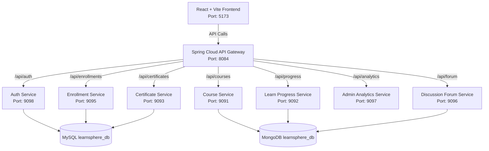
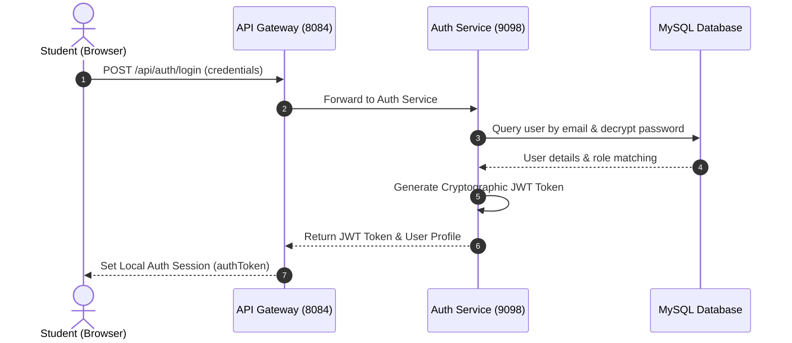
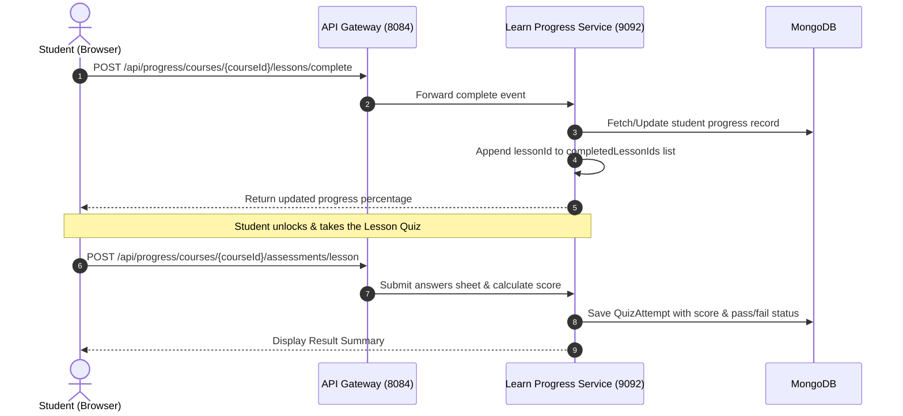

# LearnSphere Platform Architecture & Functionality Manual

This document serves as the master reference guide for the **LearnSphere E-learning Platform**. It describes the system's architecture, frontend component hierarchies, backend microservice implementations, database schemas, and execution workflows to assist in future platform identification, onboarding, maintenance, and development.

---

## 1. System Overview

LearnSphere is a modern, enterprise-grade E-learning platform designed with a **Microservices Architecture**. It enables students to enroll in courses, study lessons, complete lesson-specific quizzes, take final assessments, participate in community discussion forums, and earn verifiable completion certificates. The platform supports three primary user roles:
1. **Learner (Student)**: Studies courses, takes tests, gets certified, and joins forums.
2. **Instructor**: Creates courses, writes lessons, designs quizzes, and monitors student progress.
3. **Admin**: Approves/rejects courses, manages user statuses, configures system-wide toggles, and views platform-wide metrics.

---

## 2. High-Level System Architecture

LearnSphere utilizes a distributed multi-tier architecture to achieve high availability, modular scaling, and decoupled data layers.



### Core Tiers:
1. **Client Tier (Frontend)**: React single-page application built with Vite and designed with custom SCSS.
2. **Edge Tier (API Gateway)**: Spring Cloud Gateway acting as the central reverse-proxy, orchestrating routing, and injecting authentication tokens.
3. **Microservices Tier (Backend)**: Spring Boot applications performing business logic, separated by domain areas.
4. **Data Tier (Databases)**: 
   - **MySQL**: Relational data (users, roles, enrollments, certificate metadata).
   - **MongoDB**: Document-oriented data (courses, lesson syllabus contents, quizzes, forum posts).

---

## 3. Frontend Implementation & Components

The frontend codebase is located under [LS-frontend](file:///d:/Full%20stack%20project/LearnSphere/LS-frontend). It uses **React 19** and compiles with **Vite 7**.

### Directory Structure & Responsibilities

```text
LS-frontend/
├── src/
│   ├── assets/             # Curated branding graphics and course thumbnails
│   ├── components/         # Shared, reusable UI components
│   │   ├── TopNavBar-S/    # Student Dashboard Navigation Header
│   │   ├── TopNavBar-I/    # Instructor Dashboard Navigation Header
│   │   ├── TopNavBar-A/    # Admin Dashboard Navigation Header
│   │   ├── SideBar-S/      # Student Dashboard Sidebar Menu
│   │   ├── SideBar-I/      # Instructor Dashboard Sidebar Menu
│   │   ├── SideBar-A/      # Admin Dashboard Sidebar Menu
│   │   ├── Skeleton/       # Premium micro-animated skeleton placeholders
│   │   └── GlobalNetworkLoader/ # Sync loader that manages initial system states
│   ├── hooks/              # Custom React hooks (e.g. useForum, useProgressiveReveal)
│   ├── services/           # Axios-based API client modules and client-side stores
│   │   ├── appStore.js     # Manages authentication tokens locally
│   │   ├── userProfileStore.js # Stores details of the currently logged-in user
│   │   ├── courseApi.js    # Client for fetching courses and lessons
│   │   ├── progressApi.js  # Client for logging completions and fetching quizzes
│   │   ├── enrollmentApi.js# Client for user-course enrollments
│   │   └── adminApi.js     # Client for admin settings and statistics
│   ├── pages/              # Domain-specific page containers
│   │   ├── Public/         # About, Contact, and General Home Page
│   │   ├── Learner/        # Student pages (MyCourses, LearnCourse, Assesment, TestTaking)
│   │   ├── instructor/     # Instructor pages (ManageCourse, CreateQuiz, CourseAnalytics)
│   │   └── admin/          # Administrator control center pages
│   ├── App.jsx             # React router configuration and layout bindings
│   └── main.jsx            # React root application bootstrap
```

### Critical Component Interactions

* **`LearnCourse.jsx` (Course Workspace)**:
  Acts as the primary learning viewport for students.
  - Fetches lessons via `getCourseLessons(courseId)`.
  - Fetches lesson-level quizzes via `getCourseQuizzesByCourseId(courseId)`.
  - Communicates lesson completions via `markLessonCompletedDb()`.
  - Unlocks the **Academic Capstone** (Final Course Assessment) once `progressPercentage === 100`.
* **`TestTaking.jsx` (Assessment Engine)**:
  Processes lesson-level quizzes and the final capstone exams.
  - Loads the specified quiz dynamically.
  - Uses an interval timer to manage seconds left based on `timeLimit`.
  - Scores submissions locally and calls `saveLessonAssessmentDb()` or `saveFinalAssessmentDb()`.
  - Redirects to `/student-layout/result` upon completion.
* **`CreateQuiz.jsx` (Instructor Assessment Builder)**:
  Enables instructors to create or update exams for their courses.
  - Populates existing quizzes on load.
  - Generates multiple choice questions with option arrays where one option satisfies `isCorrect: true`.

---

## 4. Backend Microservices Architecture

Each service operates as an independent Spring Boot application located under [LS-backend](file:///d:/Full%20stack%20project/LearnSphere/LS-backend).

### Port Registry & Microservices Summary

| Service Name | Port | Database Used | Primary Responsibilities |
|---|---|---|---|
| **`api-gateway`** | `8084` | *None* | Performs reverse proxying, routes client calls to individual microservices. |
| **`auth-service`** | `9098` | MySQL | User registration, logins, password crypts, and generating JWT tokens. |
| **`course-service`** | `9091` | MongoDB | CRUD for courses, lesson contents (`course_contents` collection), and categories. |
| **`learn-progress-service`** | `9092` | MongoDB | Tracks lesson completions, reads/saves quizzes, and evaluates assessment attempts. |
| **`certificate-service`** | `9093` | MySQL | Generates capstone completion credentials, verifies digital certificate validity. |
| **`enrollment-service`** | `9095` | MySQL | Handles students signing up for courses, enrollment activations, and suspensions. |
| **`discussion-notification-service`** | `9096` | MongoDB | Community Q&A forum threads, nested comment replies, and notification alerts. |
| **`admin-analytics-service`** | `9097` | MySQL & MongoDB | Gathers stats, compiles user roll-ups, and course ratings. |

---

## 5. Database Schema & Data Modeling

LearnSphere implements a split polyglot persistence model to handle structural business logic in MySQL and rich, dynamic documents in MongoDB.

### A. MySQL Relational Schema (`learnsphere_db` database)

```sql
-- 1. Roles table
CREATE TABLE roles (
  id INT AUTO_INCREMENT PRIMARY KEY,
  name VARCHAR(50) UNIQUE NOT NULL  -- 'admin', 'instructor', 'learner'
);

-- 2. Users table
CREATE TABLE users (
  id INT AUTO_INCREMENT PRIMARY KEY,
  oauth_id VARCHAR(150),
  name VARCHAR(100) NOT NULL,
  email VARCHAR(120) UNIQUE NOT NULL,
  password VARCHAR(255),
  role_id INT NOT NULL,
  status ENUM('active','suspended') DEFAULT 'active',
  created_at TIMESTAMP DEFAULT CURRENT_TIMESTAMP,
  FOREIGN KEY (role_id) REFERENCES roles(id)
);

-- 3. Enrollments table
CREATE TABLE enrollments (
  id INT AUTO_INCREMENT PRIMARY KEY,
  student_id INT NOT NULL,
  course_id VARCHAR(50) NOT NULL,   -- Maps to MongoDB Course _id string
  status ENUM('active','suspended') DEFAULT 'active',
  enrolled_at TIMESTAMP DEFAULT CURRENT_TIMESTAMP,
  UNIQUE(student_id, course_id),
  FOREIGN KEY (student_id) REFERENCES users(id)
);

-- 4. Certificates table
CREATE TABLE certificates (
  id INT AUTO_INCREMENT PRIMARY KEY,
  student_id INT NOT NULL,
  course_id VARCHAR(50) NOT NULL,   -- Maps to MongoDB Course _id string
  issued_at TIMESTAMP DEFAULT CURRENT_TIMESTAMP,
  UNIQUE(student_id, course_id),
  FOREIGN KEY (student_id) REFERENCES users(id)
);

-- 5. Reviews table
CREATE TABLE reviews (
  id INT AUTO_INCREMENT PRIMARY KEY,
  student_id INT NOT NULL,
  course_id VARCHAR(50) NOT NULL,
  rating INT CHECK (rating BETWEEN 1 AND 5),
  comment TEXT,
  created_at TIMESTAMP DEFAULT CURRENT_TIMESTAMP,
  FOREIGN KEY (student_id) REFERENCES users(id)
);
```

### B. MongoDB Document Schema (`learnsphere_db` database)

#### Collection: `courses`
Stores the metadata for all courses on the platform.
```json
{
  "_id": ObjectId("69a682e9908ec13c425e3f91"),
  "title": "Decentralized Application (DApp) Development",
  "description": "Learn how to build, deploy, and connect production DApps on Ethereum.",
  "thumbnail": "assets/dapp.png",
  "price": 999,
  "categoryId": "699dbd18331db413dd85d9b3",
  "instructorId": "12",
  "status": "PUBLISHED",
  "createdAt": ISODate("2026-03-03T06:42:49.459Z"),
  "updatedAt": ISODate("2026-03-03T06:47:46.933Z"),
  "moderationNote": "APPROVED"
}
```

#### Collection: `course_contents` (Lessons)
Stores individual lesson records. Bound to the course by `courseId`.
```json
{
  "_id": ObjectId("69a84b6cb4c77f4d7afc6c41"),
  "courseId": "69a682e9908ec13c425e3f91",
  "title": "Understanding Decentralized Applications (DApps)",
  "description": "Architecture, key differences from web2, and smart contract backends.",
  "heading": "Understanding Decentralized Applications (DApps)",
  "subheadings": [],
  "type": "video",
  "fileName": "Dapp.mp4",
  "fileUrl": "https://learnsphere-storage.s3.amazonaws.com/materials/Dapp.mp4",
  "mimeType": "video/mp4",
  "orderIndex": 1,
  "uploadedAt": ISODate("2026-03-04T15:15:45.086Z")
}
```

#### Collection: `quizzes`
Contains the quizzes designed by instructors or seeded for courses. Both lesson-level quizzes and capstone final assessments are stored in this collection.
```json
{
  "_id": ObjectId("69a84b6cb4c77f4d7afc6c78"),
  "courseId": "69a682e9908ec13c425e3f91",
  "instructorId": "12",
  "quizTitle": "Lesson 2 Quiz: DApp Concepts",
  "description": "Assess your understanding of Web3 architecture.",
  "assessmentType": "LESSON", // 'LESSON' or 'FINAL'
  "lessonId": "69a84b6cb4c77f4d7afc6c41", // null if assessmentType is 'FINAL'
  "lessonTitle": "Understanding Decentralized Applications (DApps)",
  "passingScore": 60,
  "timeLimit": 15,
  "questions": [
    {
      "id": "l2_q1",
      "question": "How do DApps differ from traditional centralized web applications regarding their backend execution?",
      "points": 10,
      "options": [
        { "text": "They run on a single local computer without a database", "isCorrect": false },
        { "text": "Their core backend logic runs on a decentralized blockchain using smart contracts", "isCorrect": true }
      ]
    }
  ],
  "createdAt": ISODate("2026-05-23T04:05:58.300Z"),
  "updatedAt": ISODate("2026-05-23T04:05:58.300Z")
}
```

---

## 6. End-to-End Workflow Diagrams

### A. Authentication & Gateway Routing



### B. Lesson Progress & Assessment Attempt Workflow



---

## 7. Developer Cheat-Sheet & Future Reference

### Maintenance Scripts
Seeding scripts are located under the `/scripts` directory at the repository root:
* **MySQL Database Seeding**: `database/sql/seed.sql`
* **MongoDB Core Courses Seeding**: `scripts/data/mongo/import_courses.mongosh.js`
* **Blockchain Course & Quizzes Seeder**: `scripts/data/mongo/seed_dapp_course_and_quizzes.mongosh.js`

To run the Mongo seeders locally:
```bash
# Seeding the main DApp course, lessons, and quizzes into learnsphere_db
mongosh "mongodb://localhost:27017/learnsphere_db" scripts/data/mongo/seed_dapp_course_and_quizzes.mongosh.js
```

### Common Configuration Locations
* **Vite API Base URL Endpoints**: [LS-frontend/.env.development](file:///d:/Full%20stack%20project/LearnSphere/LS-frontend/.env.development)
* **Backend Spring Configuration Profiles**: `src/main/resources/application.properties` (within each microservice directory).
* **MySQL / Mongo URLs**: Defined inside each microservice's `application.properties` profile (e.g. `spring.data.mongodb.uri=mongodb://localhost:27017/learnsphere_db` and `spring.datasource.url=jdbc:mysql://localhost:3306/learnsphere_db`).
