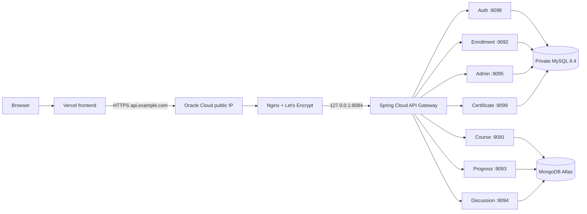

# Oracle Cloud Free Tier deployment

## Architecture



Only TCP 22, 80, and 443 are public. Nginx is managed by systemd. The gateway is
bound to loopback; all other containers are reachable only by Docker DNS on the
`backend` network.

## Capacity

Use an Ampere A1 Flex Ubuntu instance (ARM64) with at least 2 OCPUs and 8 GB RAM;
4 OCPUs/24 GB is the preferred Always Free allocation when tenancy capacity is
available. The seven Spring services cannot run reliably on the 1 GB AMD micro
shape. Compose caps the stack at about 3.6 GB plus Docker/OS overhead and uses
Serial GC, one active processor per JVM, lazy bean initialization, and bounded
JSON logs.

## Files

- `docker-compose.yml`: private service topology, limits, health checks, and volumes
- `.env.example`: secret and connection template; `.env` remains ignored
- `LS-backend/*/Dockerfile`: multi-stage, ARM64-compatible Java 21 images
- `nginx/learnsphere.conf.template`: TLS reverse proxy and rate limiting
- `scripts/setup-vm.sh`: Docker, Nginx, Certbot, firewall, and log rotation
- `scripts/configure-ssl.sh`: initial certificate and renewal setup
- `scripts/deploy.sh`, `verify.sh`, `backup.sh`, `rollback.sh`: operations

## One-time provisioning

1. Create the Ubuntu Ampere A1 VM and reserve its public IP.
2. In the Oracle VCN security list/NSG, allow inbound TCP 22, 80, and 443 only.
3. Point the API DNS A record to that public IP.
4. Add the VM public IP as a `/32` entry in MongoDB Atlas Network Access. Do not
   use `0.0.0.0/0`. Create a least-privilege Atlas database user.
5. Clone the repository on the VM and run:

```bash
cd LearnSphere
chmod +x scripts/*.sh
sudo ./scripts/setup-vm.sh
# Log out/in, then:
cp .env.example .env
nano .env
chmod 600 .env
./scripts/deploy.sh
sudo ./scripts/configure-ssl.sh api.example.com ops@example.com
```

Generate secrets with `openssl rand -base64 48`. URL-encode special characters
in MongoDB usernames/passwords. Update Vercel's API base URL to
`https://api.example.com` and ensure the domain is permitted by the gateway's
existing CORS configuration.

Docker starts at boot and `restart: unless-stopped` restores every container.
Nginx and Certbot renewal are systemd-enabled.

## Routing

Nginx forwards all paths to the gateway. Existing gateway rules route auth,
courses/categories, enrollments/payments, progress, discussions/notifications,
admin, and certificates to service DNS names supplied by Compose. Internal
service calls also use Docker DNS instead of public URLs.

## Verification

```bash
./scripts/verify.sh https://api.example.com
docker compose ps
docker compose logs --tail=100 api-gateway
curl -I https://api.example.com/actuator/health
sudo certbot renew --dry-run
sudo nginx -t
```

Check a representative public endpoint and an authenticated endpoint from the
Vercel frontend. In Atlas, confirm connections originate from the Oracle IP.
Watch memory with `docker stats --no-stream` and disk with `df -h`.

## Backups and production logging

Container logs rotate at 10 MB with three files. Nginx logs rotate daily for 14
days. Schedule MySQL backups after testing object-storage upload:

```cron
15 2 * * * cd /opt/learnsphere && ./scripts/backup.sh >> /var/log/learnsphere-backup.log 2>&1
```

Local-only backups do not protect against VM loss; copy encrypted backups to OCI
Object Storage or another off-host target. Atlas backups depend on the selected
Atlas plan and must be configured separately.

## Rollback

Before deployment, create a database backup:

```bash
./scripts/backup.sh
./scripts/deploy.sh
```

For an application rollback:

```bash
./scripts/rollback.sh <known-good-commit>
./scripts/verify.sh https://api.example.com
```

The rollback deliberately retains MySQL and certificate volumes. If a schema
change must be reversed, stop writes, take another backup, and restore the
validated pre-deploy dump explicitly; automatic destructive database rollback is
intentionally excluded.
